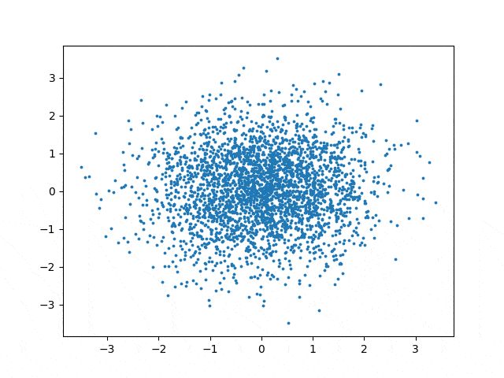

# nf-jax-sap
Using Normalizing Flows to generate the SAP logo. Implemented using JAX.

The implementation of the normalizing flow comes from Eric Jang's implementation of Real-NVP ([link](https://github.com/ericjang/nf-jax)). This is accompanied by a nice blog post: https://blog.evjang.com/2019/07/nf-jax.html

